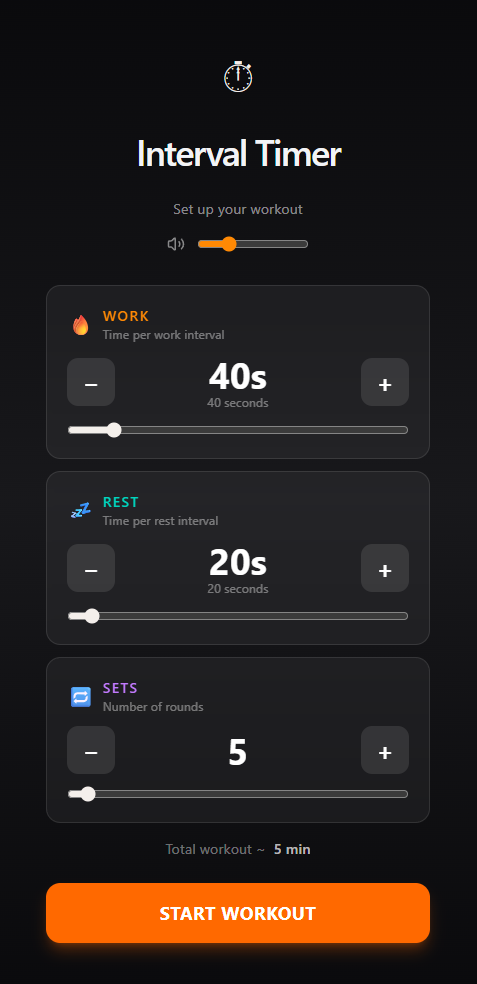

# Simple Interval Timer

A mobile-first workout interval timer built with React 19, TypeScript, and Tailwind CSS v4. Configure work/rest durations and number of sets, then go fullscreen with audio cues and a live progress ring.

🚀 **[Live Demo → interval-timer.onew.dev](https://interval-timer.onew.dev)**



## Features

- **Configurable intervals** — set work time, rest time, and number of sets via sliders or +/− buttons
- **3-2-1 countdown sounds** — audio cues at the last 3 seconds of every phase
- **Phase audio** — distinct sounds for work start, rest start, and workout finish
- **Volume control** — slider and mute toggle, persisted to `localStorage`
- **Fullscreen + Wake Lock** — screen stays on and goes fullscreen during a workout
- **Progress ring** — animated SVG ring with per-phase color theming
- **PWA-ready** — viewport and theme-color meta tags, custom icon

## Stack

| Tool         | Version                  |
| ------------ | ------------------------ |
| React        | 19 (with React Compiler) |
| TypeScript   | 5                        |
| Vite         | 8                        |
| Tailwind CSS | v4                       |
| React Router | v7                       |
| Howler.js    | 2                        |
| Lucide React | latest                   |

## Getting Started

```bash
npm install
npm run dev
```

Open [http://localhost:5173](http://localhost:5173).

## Build

```bash
npm run build
```

Output goes to `dist/`.

## Project Structure

```
src/
  components/
    setup/
      NumberInput.tsx      # Work/rest/sets input card
    timer/
      ProgressRing.tsx     # Animated SVG progress ring
      phaseStyles.ts       # Per-phase colors and labels
    ui/
      button.tsx           # Base button component
  hooks/
    useIntervalTimer.ts    # Timer state machine
    useAudioSettings.ts    # Volume + mute, persisted to localStorage
  lib/
    audio.ts               # Howler.js sound playback
  pages/
    SetupPage.tsx          # Setup form
    TimerPage.tsx          # Fullscreen active timer
```
